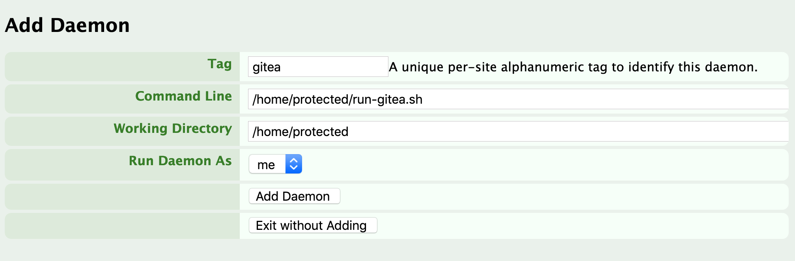
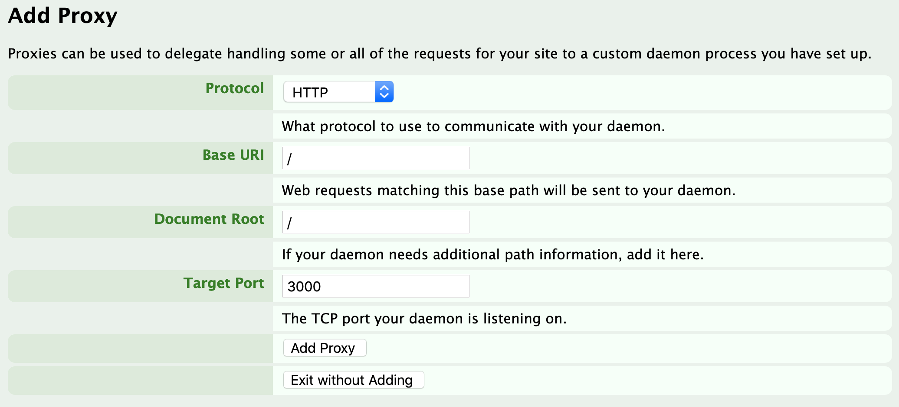
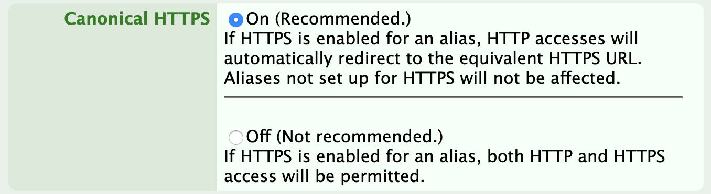

It's generally impossible to only use services, private or government, that
perfectly align with one's values, so one must opt to choose one's battles.
The [controversy over GitHub's contract with U.S. Immigration and Customs
Enforcement](https://www.latimes.com/business/technology/story/2019-10-31/github-ice-contract-defense) is the latest such
battle in the open-source software world.  GitHub employees and users
are trying to pressure GitHub to drop the contract, as a way to place greater
pressure on ICE and the U.S. government to curtail crimes and human rights abuses. 

[A letter to GitHub](https://github.com/drop-ice/dear-github-2.0) signed by
many open-source maintainers has raised the profile of this campaign. It stops
short of calling for users to abandon GitHub, but many users concerned about
this issue are searching for alternatives and considering how much they are
locked in to GitHub's ecosystem. I realize that I'm fairly locked in myself,
in both personal and professional projects.  While I'm not prepared to leave
GitHub entirely, I wanted to see how hard it would be to set up a system where I have greater
control. So here is documentation of setting up a git hosting service with
using [Gitea](https://gitea.io) and [nearlyfreespeech.net](https://nearlyfreespeech.net).

<!--more--> 

There are a number of git hosting alternatives to GitHub, including BitBucket
and the partially open-source GitLab (which can be self-hosted). [Gitea](https://gitea.io) 
is an open-source, non-commercial, and community managed self-hosted git hosting web server, written in Go.
Forked from a one-person project called [gogs](https://gogs.io/), it is funded by both
crowd funding and some corporate contributions. It's smaller and simpler than
GitLab, and as a non-commercial service, less likely to be entangled to similar
controversies.

I've opted to set up a Gitea service on  [nearlyfreespeech.net](https://nearlyfreespeech.net) (NFSN),
which I also use to host this blog.  NFSN is a small private
web hosting service that's optimized for tinkerers - it requires some Linux knowledge but they
give you a great deal of control, including SSH access. Using NFSN is
pretty close to self-hosting in terms of setup, but you don't run your own hardware and it's probably
cheaper (though not free), and a bit less hassle than running on some other cloud service, like EC2 (that you
might avoid for other reasons anyway).  NFSN's biggest limitation for me may be that it does
not support Docker; one has to configure more oneself, but this probably keeps
websites lean.

NFSN has a fairly libertarian philosophy 
to hosting - they have strong security and privacy controls, and will unlikely
ever do business with a Big Tech company or government.
Yet they also will let anything legal on their site, opting to [donate any profits
from sites that fail to meet it's ethical standards to charity](https://faq.nearlyfreespeech.net/section/policy/becausefucknazisthatswhy#becausefucknazisthatswhy).
One could argue this isn't ethically different than GitHub's current policies.
One picks battles for many different reasons; in the face of imperfect choices,
I think supporting the GitHub campaign by offering alternatives is worthwhile.

### Register an NFSN site

First, one must sign up for NFSN. It's not free but it is very cheap.  My
main site costs a few dollars per year - for a few more you can register a domain
name though NFSN, too.

Create a new site on NFSN selecting the "Custom" server type. Once you do so you can
click on the site control panel (`https://members.nearlyfreespeech.net/USER/sites/SITENAME/`). 
Under "SSH/SFTP Information" there should be everything needed to login to your
site server via SSH. Log in. Keep the site control panel open in the browser,
we'll return to it later.

### Build and install Gitea

Gitea has pre-built binaries and packages but for NFSN's environment I found
it slightly easier to build Gitea from source.  Thankfully everything needed to do so
is pre-installed on NFSN's servers.  Once you're logged in, run the following
from the SSH console to build the Gitea binary for use.

```bash
# Fetch and build the source
export GOPATH=/home/private/go
go get -d -u -v code.gitea.io/gitea
cd $GOPATH/src/code.gitea.io/gitea/
git branch -a
git checkout v1.10.1
# build the source using sqlite as the site database
# (other databases can be used but take some more set-up)
TAGS="bindata sqlite sqlite_unlock_notify" make generate build
# Move the binary
mv gitea /home/protected/gitea
cd /protected
# Get rid of the source repo
rm -rf $GOPATH
```

### Create a daemon and proxy

Now NFSN needs to be told how to run Gitea and connect users to it.  First,
via the command line on SSH, create a startup script in the `protected`
directory. {}See [here](https://members.nearlyfreespeech.net/faq?q=Directories#Directories)
for info about the NFSN directory structure.{}

```bash
echo "#!/bin/bash\nexec /home/protected/gitea" > /home/protected/run-gitea.sh
chmod a+x /home/protected/run-gitea.sh
```
Next, in the NFSN site control panel, go to "Daemons" and add a new daemon
that runs your startup script, filling in the form as follows:



This tells NFSN to run the Gitea program.  Now you need users to connect to it.
In your site control panel go to "Proxies" and add a proxy.  The only thing
you need to change from the default is to set the port to `3000`, Gitea's default:



Now in the control panel, go to "Daemons" and click "Start" on the daemon you
added.

### Startup config

Your Gitea server should be running now. Visit your site (`SITENAME.nfshost.com`
unless you registered a domain), and you should see Gitea's startup screen.

Fill in the initial configuration and set up your admin user.  Set any paths so they are below `/home/protected`.
Do not change the runtime user name (a number), but disable
SSH access, which isn't allowed by NFSN{}Even with SSH turned off, you (as site admin with back-end SSH access), could still access repos using the URI `NFSN-USERNAME_NFSN-SITE@ssh.phx.nearlyfreespeech.net:/home/protected/gitea-repositories/GITEA-USER/REPO-NAME.git`
{}	.

If you're unsure about other configuration options, don't worry, you can always change them later.

### HTTPS/TLS and other configuration

You probably want to set up encrypted connections via TLS/HTTPS. NFSN has some
helpers to do this using [Let's Encrypt](https://letsencrypt.org/) but 
they need just a bit of tweaking.{}Gitea has it's [own HTTPS sever setup instructions](https://docs.gitea.io/en-us/https-setup/) 
but as we're behind NFSN's proxy they're not relevant here.{} This is because it NFSN's tools expect web-visible files to be in the 
`/home/public/` directory.  However, with Gitea, static files are served
from `/home/protected/custom/public`.  So, in the SSH console, create a symbolic
link by running this:

```bash
ln -s /home/public /home/protected/custom/public
```

Now run NFSN's automatic Let's Encrypt setup:

```bash
tls-setup.sh -v
```

Next, make sure Gitea knows its proper URL. If you've started Gitea at least once,
Gitea's main configuration file now be found at `/home/protected/custom/conf/app.ini`.  
You can edit that file by running:

```bash
nano  /home/protected/custom/conf/app.ini
```

(or use your favorite shell editor).

Find the line for `ROOT_URL` and set it to your site URL, starting with `https://`.{}A full list of configuration variables
can be found [here](https://docs.gitea.io/en-us/config-cheat-sheet/).  A few
you may want to turn on or off are those that control whether external users
can register (`DISABLE REGISTRATION`), whether you want to use a Captcha to
prevent spam (`ENABLE_CAPTCHA`), both under the `[service]` section, or `MAX_CREATION_LIMIT` to limit repositories per user, under `[repository]`.{}

When you change configurations in `app.ini`, you'll need to restart the Gitea
server.  Do this in you NFSN site console by hitting "Stop" on your Gitea
daemon, than "Start" again.

Finally, so that users are always directed to the HTTPS site, go to "Config
Information" in the NFSN console and click "Edit" under "Canonical URL".  Set
"Canonical HTTPS" to "On", to make sure users are always redirected to the secure
site:



### That's it!

Your Gitea server should be working.  Mine is at <https://gitea.noamross.net>.
I've yet to migrate many projects into it, but I hope this exploration has been
useful to someone.


